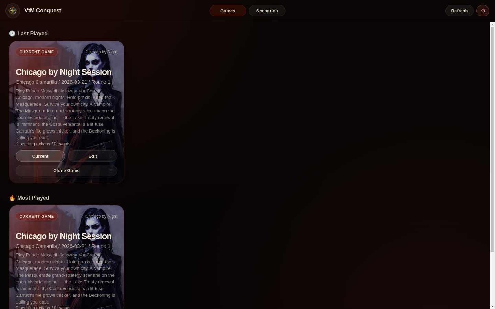

<!-- Open Historia — portions (install, Android app, hub & preset docs) © 2026 Nicholas Krol, MIT (see src/Editor/LICENSE). -->

> **VtM_Conquest** — a fork of [Open Historia](https://github.com/Open-Historia/open-historia)
> (pristine upstream snapshot: commit `a6315c6`, `pristine` branch) converted into a
> *Vampire: The Masquerade* grand-strategy game. Eleven built-in scenarios across the
> World of Darkness — from Chicago's Camarilla court to the Anarch free city of Los
> Angeles, the Kuei-jin court of Tokyo, and the Cross-Tasman Compact of Aotearoa — all
> beginning the same night, March 21, 2026, and simulating forward from there. Upstream
> changes land on `pristine`; the VtM conversion (scenario + engine enablers) lives on
> `vtm-chicago`.

<h1 align="center">VtM Conquest</h1>

<div align="center">
  <strong>A gothic <em>Vampire: The Masquerade</em> grand-strategy sandbox, built on the open-source <a href="https://github.com/Open-Historia/open-historia">Open Historia</a> engine.</strong>
</div>

<br />

<div align="center">
  <!-- Discord -->
  <a href="https://discord.gg/QaqAK7fQAg">
    
  </a>
  <!-- Reddit -->
  <a href="https://www.reddit.com/r/OpenHistoria">
    
  </a>
  <!-- License -->
  <a href="LICENSE">
    
  </a>
  <!-- Status -->
  <a href="#">
    
  </a>
</div>

<div align="center">
  <sub>Built with ❤︎ by <a href="https://github.com/Open-Historia/open-historia/graphs/contributors">contributors</a>.
</div>

<br />
<br />

<div align="center">
  
  <p><sub>The launcher splash: pick up a current session or start fresh from the scenario library.</sub></p>
</div>

---

## ✨ Features

- __eleven built-in scenarios:__ Chicago, Melbourne, Sydney, Brisbane, Adelaide, Berlin, London, New York, Los Angeles, Tokyo and Aotearoa (Auckland & Wellington) — each with its own polity map, cast, chronicle hooks and sim rules (see [Scenarios](#-scenarios))
- __interactive world map:__ watch territory, borders, and domains shift night by night — hand-authored district maps rendered on real satellite imagery
- __ai-generated events:__ dynamic events shaped by your decisions and the state of the world
- __diplomacy:__ negotiate with AI-controlled Kindred, courts and factions through natural language chat — click any polity to talk to it, or wait for them to reach out first
- __ai advisor:__ each scenario ships its own advisor with their own agenda — from Chicago's Lukas Yates to Tokyo's Sebastian Aldington
- __world-state tracks:__ scenarios define global mechanics like Masquerade Integrity and Inquisition Heat; every breach moves the clocks, and the world answers at the extremes
- __catalysts:__ branching decision scenes that trigger when the night demands your personal ruling
- __map editor:__ a full vector map editor (draw, split, merge, paint owners, cities) built into the scenario editor — build a domain and hit *Apply & Play*
- __troops:__ Kindred-scale forces (coteries, hounds, proxies, retainers, sorcery, havenguard) — deploy, move and battle; the AI resolves them
- __scenario hub:__ browse, vote on and import community scenarios from the in-game **Community** tab, and publish your own
- __self-hostable:__ run your own instance with your own AI backend completely offline

---

## 🚀 Play

### In your browser

**[openhistoria.com](https://openhistoria.com)** — upstream Open Historia's hosted instance
(upstream engine, upstream scenarios — not the VtM conversion). Nothing to install. Games are
saved in your browser, and you bring your own AI key (it goes straight to your provider, never
to them). The world map is served by the community
[content-node network](https://github.com/Open-Historia/open-historia-node).

Local AI (Ollama, LM Studio) needs one extra step in the browser: the server has to allow
the site's origin, e.g. start Ollama with `OLLAMA_ORIGINS=https://openhistoria.com`. The
desktop app below needs no such setup.

### Desktop (offline, single-player)

Grab the installer for your platform from this project's **releases page**
(~210 MB — code *and* all scenarios *and* all map data), then:

- **Windows:** run **`VtM-Conquest-Setup.exe`**, then open VtM Conquest from the Start Menu
- **macOS:** unzip and drag **VtM Conquest** to Applications (first run: right-click -> *Open*)
- **Linux:** `chmod +x VtM-Conquest-x86_64.AppImage` and run it

The desktop app is fully packaged and runs offline out of the box — no Node.js
setup, no build step. Your games, scenarios and settings persist across
installs; to update, run the newest installer over the top.

> [!TIP]
> Run the launcher **normally** — it does not need (and works better without)
> administrator rights: an elevated window gets the admin account's environment,
> which can hide a Node.js that was installed for your own account.


#### Android app (thin APK) — upstream only

> [!NOTE]
> The Android app is an **upstream Open Historia** artifact; this fork does not
> ship its own APK.

Easiest: download **`open-historia.apk`** from the
[**Android release**](https://github.com/Open-Historia/open-historia/releases/tag/android)
and open it to install (allow installs from your browser when Android asks).
It's a thin client: the game itself runs on whatever server it connects to, so you need
one of the two:

- **A desktop on the same network** running the launcher — type its address
  (e.g. `http://192.168.1.20:3000`) into the app once; it's remembered.
- **[Termux](https://termux.dev/) on the phone itself** running the server — the app
  finds it on first launch by itself, no address needed.

<details>
<summary>Build the APK yourself (needs the Android SDK)</summary>

```bash
cd mobile
npm install
npx cap sync android
cd android && ./gradlew assembleDebug   # gradlew.bat on Windows
```

The APK lands in `mobile/android/app/build/outputs/apk/debug/`. (Or open
`mobile/android` in Android Studio and press Run.) Maintainers: the
**Build Android APK** action in the Actions tab builds and republishes the
release APK — run it after changing `mobile/`.

</details>

### Manual

Prerequisites: [Git](https://git-scm.com/) and [Node.js](https://nodejs.org/en) 22 LTS or newer (minimum 20.19 / 22.12 — the client build runs on Vite 7, which requires it).

```bash
git clone <your-fork-url>.git
cd vtm-conquest
node scripts/fetch-map-assets.mjs  # Download the world map data (see note below)
npm install                        # Install dependencies (includes OpenLayers etc. for the editor)
npm run build                      # Build the client
node server/server.js              # Start the server
```

Then open **http://localhost:3000** in your browser.

> [!TIP]
> **Running the server only — Termux/Android, a headless box, a NAS?** Skip the
> desktop-app tooling:
>
> ```bash
> npm install --omit=dev --omit=optional
> ```
>
> That drops Electron and its build chain (783 packages → 286) while keeping
> everything the client build and the server actually need. On Android it is the
> difference between working and not: Electron publishes no Android build, so its
> install script exits with *"Electron builds are not available on platform:
> android"*. A plain `npm install` still succeeds there — Electron is an
> `optionalDependency`, so npm reports the failure and carries on — but there is no
> reason to download it in the first place.

> **Note:** the large map binaries (`*.pmtiles`, `public/assets/*-seed.*`, and
> `server/data/scenarios/default/regions.geojson`) are **not** in the repo — they are
> hosted as [GitHub Release assets](https://github.com/Open-Historia/open-historia/releases/tag/map-data)
> and downloaded by `scripts/fetch-map-assets.mjs`. The launcher script for your platform
> runs this for you automatically, so a plain ZIP download works too — no Git LFS needed.

---

## 🌍 Scenarios

Every scenario begins on the **same night — March 21, 2026 —** and simulates forward from
there. Each ships its own district map, polity set, cast, chronicle hooks, simulation
constitution, and prompt set (leader, advisor, diplomacy, catalysts).

| Scenario | You play | The night in one line |
|---|---|---|
| **Chicago by Night** | Prince Maxwell Holloway-VanCort | Hold the Camarilla court together on the night of the Lake Treaty renewal |
| **Melbourne by Night** | Prince Lytton | The elder prince's domain between methuselah Sydney and a Sabbat-taken Brisbane |
| **Sydney by Night** | Sarrasine's domain | A methuselah's independent city watching the Pacific darken |
| **Brisbane by Night** | Bishop Callista Vox's Sabbat | Hold the reclaimed city against the coming counter-stroke |
| **Adelaide by Night** | Octavia Marsh | A careful smaller domain under Lytton's patronage |
| **Berlin by Night** | The Berlin Anarchs | A Brujah council holding free ground against Camarilla holdouts, BfV hunters and a broken pyramid |
| **London by Night** | Queen Anne Bowesley | Westminster protocol, October Restrictions, and an Inquisition inside the Five Eyes wire |
| **New York by Night** | Augusta Vandenberg | Post-Sabbat reclamation Manhattan: five polities, one fragile balance |
| **Los Angeles by Night** | Salvador Garcia's Council of Barons | The Movement's free domain: baronial votes, the border, and the Silicon Beach doom clock |
| **Tokyo by Night** | Madame Hélène Decourcelle | Keep a 154-year treaty between the Kuei-jin court and the last registered Western Kindred alive under PSIA surveillance |
| **Aotearoa by Night** | Princess Beatrice Hartley-Cowan | Two cities, two Garou septs, one Compact — and a 2027 review that will redefine Wellington |

Each scenario lives in `server/data/scenarios/<id>/`: `world.json` (polities, ownership,
simulation rules, opening timeline), `regions.geojson` / `cities.geojson` (the district
map), `prompts.json` (the AI role instruction sets), and `cover-image.bin` (splash art).

Community scenarios from the [**Scenario Hub**](https://github.com/Open-Historia/Open-historia-scenarios)
still import through the in-game **Community** tab. To regenerate the built-in Modern Day
map (upstream's sandbox world): `node scripts/build-default-map.mjs`

## 🗺️ Map editor

Open any scenario's editor and click **🗺️ Open Map Editor** (or visit
`http://localhost:3000/?editor=1` for the standalone editor). Draw regions, split and
merge borders freehand, paint owners, import 70k cities, sign your map, then
**Apply & Play**.

## 🖥️ Host a server node

Want to help the network? Run a **content node** on your own device to cache and serve
the game's map data to nearby players so everyone loads faster. It's a one-click install
and deliberately safe — a node only ever serves **read-only, checksum-verified** map
files, and never touches anyone's games, accounts, AI keys, or code.

➡️ **[Set up a node → Open-Historia/open-historia-node](https://github.com/Open-Historia/open-historia-node)**

Your node registers itself and starts serving players once an admin accepts it. See the
[node README](https://github.com/Open-Historia/open-historia-node#readme) for the full
walkthrough (including a free Cloudflare Tunnel to put it online).
